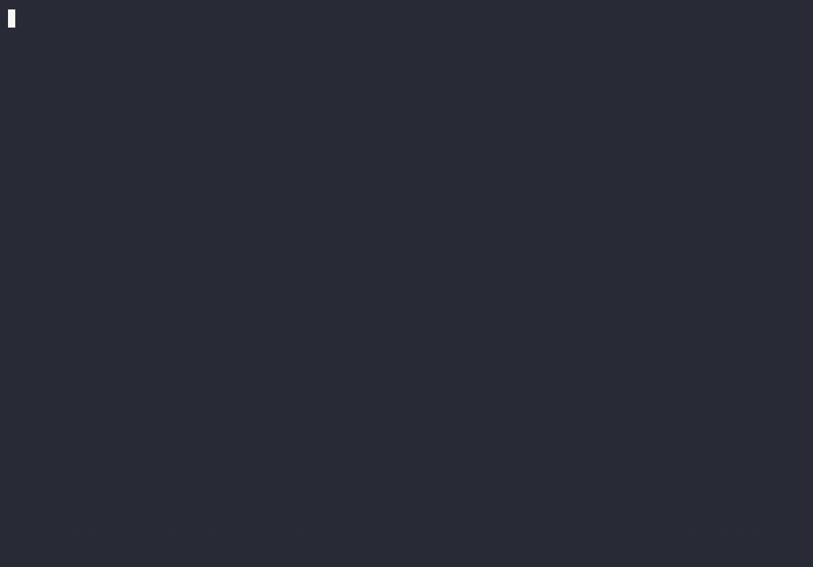
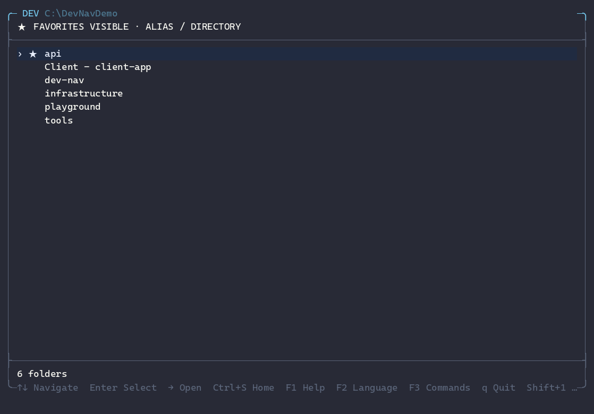
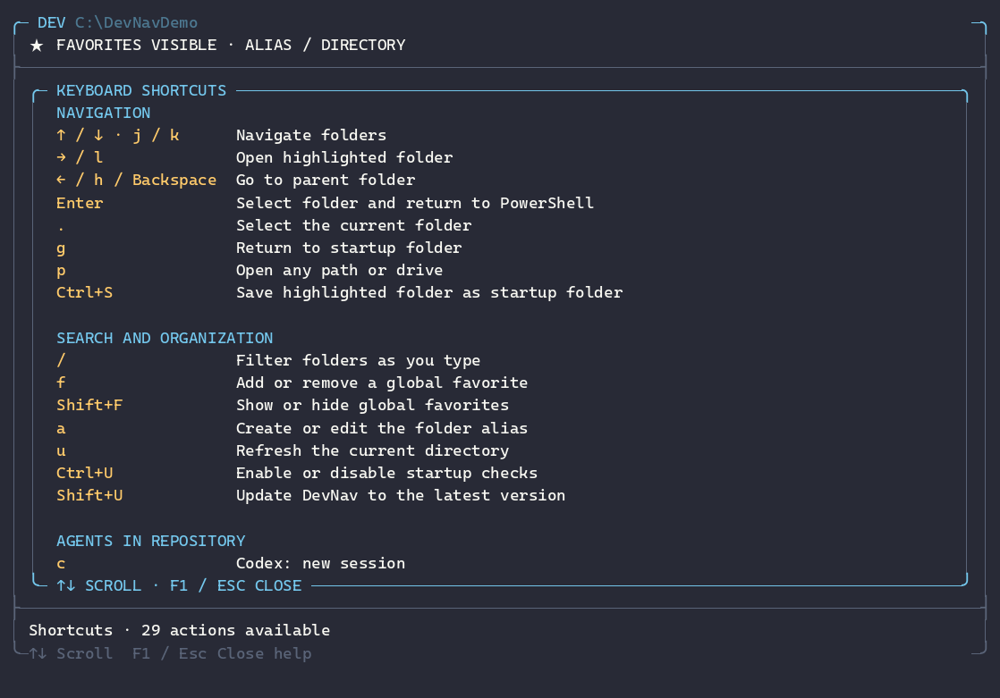
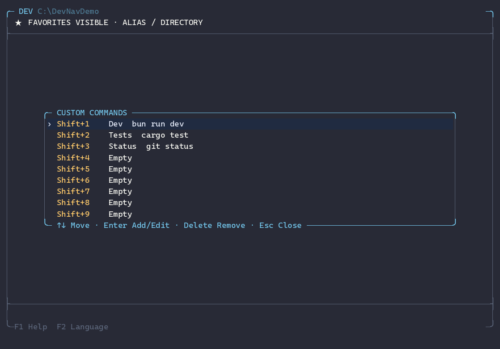

# DevNav

**Navegación rápida y nativa entre proyectos para PowerShell 7 en Windows.**

[](https://github.com/JacobOptimiza/dev-nav/actions/workflows/ci.yml)
[](https://github.com/JacobOptimiza/dev-nav/actions/workflows/codeql.yml)
[](https://www.bestpractices.dev/projects/14088)
[](https://scorecard.dev/viewer/?uri=github.com/JacobOptimiza/dev-nav)
[](https://github.com/JacobOptimiza/dev-nav/releases/latest)
[](https://learn.microsoft.com/powershell/)
[](https://www.rust-lang.org/tools/install)
[](https://www.npmjs.com/package/@jacoboptimiza/devnav)
[](LICENSE)

[English](README.md) | **Español**

DevNav es un navegador nativo de workspaces para desarrolladores que trabajan desde PowerShell y manejan múltiples repositorios. Encuentra un proyecto con búsqueda difusa, entra en él y lanza el agente o comando que necesitas sin romper el flujo de la terminal.

## Por qué DevNav

Trabajar con muchos repositorios añade fricción más allá de escribir `cd`: recordar rutas, cambiar de contexto, encontrar el workspace correcto y repetir preparación antes de empezar el trabajo real.

DevNav convierte ese esfuerzo en un flujo rápido y repetible:

- **Encuentra y salta al instante** — busca proyectos de forma difusa en lugar de recorrer carpetas o memorizar rutas.
- **Reduce el cambio de contexto** — favoritos, alias y comandos personalizados mantienen el trabajo frecuente a una sola acción de distancia.
- **Empieza listo para trabajar** — lanza agentes de programación o comandos directamente en el repositorio seleccionado y en el contexto correcto.
- **Mantén velocidad y ligereza** — el núcleo es Rust nativo, pensado para un flujo de terminal ágil y sin necesitar runtimes adicionales después de la instalación.



Salta entre proyectos, filtra espacios de trabajo, guarda favoritos y alias, y
abre agentes de programación o ejecuta comandos directamente en el repositorio
seleccionado.

## Vista previa de la TUI

Capturas reales del ejecutable nativo de DevNav: el navegador, el panel de
ayuda F1 y el gestor centrado de comandos personalizados F3.

### Navegador



### Ayuda — F1



### Comandos personalizados — F3



## Instalar DevNav

Elige la herramienta que ya utilizas. Cada bootstrap instala la misma release
nativa de DevNav para Windows x64 o ARM64.

### Gestores de paquetes

#### Bun

```powershell
bunx --bun @jacoboptimiza/devnav install
```

#### npm

```powershell
npx --yes @jacoboptimiza/devnav install
```

#### pnpm

```powershell
pnx @jacoboptimiza/devnav install
```

#### Yarn

```powershell
yarn dlx -p @jacoboptimiza/devnav devnav install
```

Son canales de bootstrap verificados, no instalaciones JavaScript de DevNav.
No tienen script `postinstall` ni dependencias en runtime: el bootstrap elige el
instalador oficial x64 o ARM64, verifica su SHA-256 con
`release-manifest.json`, lo instala y valida la versión final.

Para npm, pnpm y Yarn, el paquete de bootstrap declara Node.js `>=22`. CI lo
valida con Node 22, 24 y 26; Node 24 es la base de release y Node 26 la vía de
compatibilidad futura. Bun ejecuta este bootstrap con su propio runtime. Ninguno
de estos runtimes es necesario después de instalar DevNav.

Después, DevNav se actualiza con `dev update`, no con npm, Bun, pnpm o Yarn. El
gestor sirve para descubrir e instalar la aplicación; no pasa a ser propietario
de la instalación.

<details>
<summary>Cómo funciona la instalación mediante gestores</summary>

El paquete npm contiene los instaladores de la release canónica de GitHub. Al
ejecutar `install`, detecta Windows y la arquitectura, comprueba el instalador
elegido contra el inventario de la release, ejecuta silenciosamente el
instalador Inno Setup por usuario y confirma que `dev.exe --version` coincide
con la versión del paquete. El gestor termina después y no es necesario en
runtime.

</details>

### Scoop

Añade el bucket oficial de DevNav:

```powershell
scoop bucket add jacoboptimiza https://github.com/JacobOptimiza/scoop-bucket
```

Instala DevNav:

```powershell
scoop install jacoboptimiza/devnav
```

Scoop instala la versión nativa portable y es el propietario de los archivos
instalados; no utiliza el instalador Inno Setup.

Actualiza las instalaciones gestionadas por Scoop con:

```powershell
scoop update devnav
```

### PowerShell

No requiere Node.js ni ningún gestor de paquetes. Ejecuta el instalador oficial
desde PowerShell 7:

```powershell
irm https://raw.githubusercontent.com/JacobOptimiza/dev-nav/main/install.ps1 | iex
```

Si prefieres inspeccionar el script antes de ejecutarlo:

```powershell
$installer = Join-Path $env:TEMP 'devnav-install.ps1'
Invoke-WebRequest https://raw.githubusercontent.com/JacobOptimiza/dev-nav/main/install.ps1 -OutFile $installer
Get-Content $installer
& $installer
```

Los mismos instaladores por usuario para x64 y ARM64 están disponibles en la
[última release de GitHub](https://github.com/JacobOptimiza/dev-nav/releases/latest).

### Otros canales de distribución

| Canal | Estado |
|---|---|
| Instalador de GitHub | Disponible |
| npm, Bun, pnpm y Yarn | Disponibles |
| Scoop | Disponible — [bucket oficial JacobOptimiza/scoop-bucket](https://github.com/JacobOptimiza/scoop-bucket) |
| WinGet | Pendiente de aprobación de Microsoft para `JacobOptimiza.DevNav` |

### Iniciar DevNav

Abre una sesión nueva de PowerShell 7:

```powershell
dev
```

Continúa con [Primer inicio](#primer-inicio-elegir-la-ruta-de-inicio) para elegir
la carpeta que DevNav mostrará al abrirse.

### Requisitos

- Windows 10 u 11 en x64 o ARM64.
- PowerShell 7 o posterior (`pwsh`).
- Windows Terminal recomendado.

Los binarios publicados no requieren Rust ni Visual Studio. Solo necesitas un
gestor de paquetes si eliges su comando de bootstrap. Windows PowerShell 5.1,
Windows de 32 bits, Linux y macOS no están soportados.

## ¿Por qué DevNav?

- Arranca directamente en el espacio de trabajo que elijas.
- Mantiene disponibles todos tus favoritos mientras navegas entre unidades.
- Abre agentes o ejecuta comandos en el repositorio resaltado.
- Devuelve correctamente los cambios de directorio a la sesión actual.
- Es una aplicación nativa para Windows, centrada en teclado y sin telemetría.

## Primer inicio: elegir la ruta de inicio

La **ruta de inicio** es la carpeta que contiene tus repositorios o aquella que
quieres ver cada vez que ejecutas `dev`. La forma recomendada de configurarla no
requiere comandos ni editar archivos:

1. Ejecuta `dev`. Sólo en el primer inicio interactivo, elige si DevNav puede
   comprobar silenciosamente si hay nuevas versiones al arrancar; nunca instala
   nada sin preguntarte.
2. Una instalación nueva se abre en `$HOME`. Navega con `↑`, `↓` y `→`. Para ir
   directamente a otra ruta o unidad, pulsa `p`, escribe la ruta deseada y
   confirma con `Enter`.
3. Resalta la carpeta que quieres utilizar como inicio.
4. Pulsa `Ctrl+S` (**guardar como ruta de inicio**).
5. Revisa la ruta mostrada y pulsa `Enter` para confirmar o `Esc` para cancelar.

El siguiente `dev` arrancará directamente en esa carpeta. Puedes repetir estos
pasos en cualquier momento para cambiarla. `Ctrl+S` utiliza una combinación
deliberada y una confirmación adicional para evitar cambios accidentales.

### Alternativa para terminales, scripts o agentes

Después de instalar, Codex, Cursor o cualquier script puede configurar la misma
ruta sin abrir la TUI:

```powershell
Set-DevRoot $HOME
Get-DevRoot
```

`Set-DevRoot` valida que la carpeta exista y guarda exactamente la misma
configuración local que `Ctrl+S`.

Para compatibilidad con configuraciones anteriores, `DEV_HOME` continúa
funcionando cuando todavía no existe una ruta guardada. La ruta elegida mediante
`Ctrl+S` o `Set-DevRoot` tiene prioridad:

```powershell
$env:DEV_HOME = $HOME
```

## Favoritos globales, incluso fuera de la raíz

Los favoritos no están limitados a la carpeta principal. Siempre aparecen al
principio de la lista, aunque estés navegando por otra ubicación. También se
muestra el favorito correspondiente al directorio actual, por lo que nunca
desaparece ninguno al entrar en él.

Los accesos globales se muestran por defecto. Pulsa `Mayús+F` para
ocultarlos o volver a mostrarlos; DevNav conserva esa preferencia entre sesiones.
Ocultarlos no elimina ningún favorito ni oculta las carpetas reales del
directorio actual.

Para añadir una carpeta de otro disco o de fuera de la ruta de inicio:

1. Ejecuta `dev`.
2. Pulsa `p`.
3. Escribe una ruta absoluta, por ejemplo `D:\Clientes` o `C:\Trabajo\Repo`.
4. Pulsa `Enter` para ir a esa ubicación.
5. Navega con las flechas y `→` hasta resaltar la carpeta deseada.
6. Pulsa `f` para guardarla como favorita.

Desde ese momento aparecerá arriba en cualquier ubicación. Resáltala y vuelve a
pulsar `f` para eliminarla de favoritos. `a` permite mostrarla como
`alias - nombre-de-carpeta`.

La ruta de inicio, los favoritos y los alias son locales y se guardan fuera del repositorio en
`%LOCALAPPDATA%\DevNav\config.tsv`.

## Atajos

Los atajos están agrupados por flujo de trabajo. Las acciones más frecuentes
aparecen primero para que sean fáciles de descubrir y recordar.

### Navegación y selección

| Atajo | Acción |
|---|---|
| `↑` / `↓` o `j` / `k` | mover la selección |
| `Enter` | seleccionar la carpeta y volver a PowerShell |
| `→` / `l` | entrar en la carpeta resaltada |
| `←` / `h` | subir al directorio padre |
| `Backspace` | subir al directorio padre |
| `.` | seleccionar el directorio mostrado |
| `g` | volver a la raíz configurada |
| `p` | ir a cualquier ruta absoluta, incluso de otro disco |
| `Ctrl+S` | guardar la carpeta resaltada como nueva ruta de inicio; requiere confirmación |
| `F1` | abrir el panel de ayuda con todos los shortcuts y su explicación |
| `F2` | cambiar entre Español e Inglés |
| `F3` | abrir el gestor de comandos personalizados |

### Agentes

| Atajo | Acción |
|---|---|
| `c` | Codex: abrir una sesión nueva (`codex`) en la carpeta resaltada |
| `r` | Codex: reanudar la última sesión del repositorio (`codex resume --last`) |
| `d` | abrir Claude Code (`claude`) en la carpeta resaltada |
| `Mayús+D` | reanudar la última sesión de Claude Code del repositorio (`claude --continue`) |
| `o` | abrir OpenCode (`opencode`) en la carpeta resaltada |
| `Mayús+O` | reanudar la última sesión de OpenCode del repositorio (`opencode --continue`) |
| `i` | abrir Kimi Code (`kimi`) en la carpeta resaltada |
| `Mayús+I` | reanudar la última sesión de Kimi Code del repositorio (`kimi --continue`) |

### Organización, búsqueda y acciones

| Atajo | Acción |
|---|---|
| `/` | activar el filtro fuzzy incremental |
| `f` | añadir o quitar un favorito global |
| `Mayús+F` | mostrar u ocultar los accesos globales de favoritos; el estado persiste entre sesiones |
| `a` | editar el alias de la carpeta resaltada |
| `e` | escribir y ejecutar un comando en la carpeta resaltada |
| `u` | refrescar el directorio mostrado |
| `Ctrl+U` | activar o desactivar la comprobación de actualizaciones al iniciar |
| `Mayús+U` | comprobar y actualizar DevNav a la última versión publicada |
| `q` / `Esc` | cancelar y volver a PowerShell |

La barra inferior muestra sólo las acciones esenciales para no saturar la
interfaz. Pulsa `F1` en cualquier momento para consultar el panel completo;
puedes desplazarte con `↑` / `↓` y cerrarlo con `F1`, `Esc` o `Enter`.

`:` se conserva como alias compatible de `e` para quienes prefieran el estilo de
comandos de Vim.

### Comandos personalizados

Asigna comandos a `Mayús+1–9` para ejecutarlos en el proyecto
resaltado:

Pulsa `F3` para abrir el gestor/modal centrado. Tiene nueve slots
`Mayús+1–9`: usa `↑` / `↓` para mover la selección o `1–9` para elegir un slot
directamente. `Enter` añade o edita y `Supr` pide confirmación para borrar. En
el editor, `Tab` cambia entre Alias y Comando, `Enter` guarda y `Esc` cancela.
`F2` cambia el idioma sin perder el estado del gestor ni el borrador. Las
combinaciones `Mayús+1–9` ejecutan comandos únicamente desde el navegador
normal, nunca mientras gestionas slots.

```powershell
dev shortcut 1 "Dev" "bun run dev"
dev shortcut 2 "Tests" "cargo test"
```

Puedes usar `Set-DevShortcut` desde scripts, sobrescribir un slot repitiendo su
índice o eliminarlo con `Remove-DevShortcut -Index 1` (o `dev shortcut 1`). Los
atajos se guardan localmente y aparecen en la ayuda de `F1`.

También puedes elegir primero el repositorio y pasar un comando desde el shell:

```powershell
dev codex
dev "git status"
```

Los accesos de agentes son opcionales: DevNav devuelve el comando a PowerShell,
por lo que únicamente necesitas tener instalado y disponible en `PATH` el CLI que
quieras abrir.

### Idioma

En el primer inicio interactivo, DevNav detecta el primer idioma compatible de
la lista de idiomas de interfaz preferidos de Windows (`es-*` o `en-*`). Muestra
una confirmación bilingüe antes de preguntar por las comprobaciones de
actualizaciones. La elección confirmada se guarda como `es-ES` o `en-US`, por lo
que solo se pregunta una vez.

Pulsa `F2` en cualquier momento para cambiar de idioma sin perder la carpeta,
selección, modo, desplazamiento ni texto introducido. Desde PowerShell:

```powershell
dev language
dev language en
dev language es
```

Los comandos equivalentes del módulo son `Get-DevLanguage` y `Set-DevLanguage`.

## Actualizar

Desde PowerShell:

```powershell
dev update
```

También puedes pulsar `Mayús+U` dentro de la TUI. DevNav compara la
versión instalada con la última release, descarga solo cuando hace falta,
verifica los archivos con SHA-256 y conserva la configuración local.

Las instalaciones iniciadas mediante npm, Bun, pnpm, Yarn, PowerShell o el
instalador de GitHub usan `dev update`; el canal de bootstrap no gestiona las
actualizaciones posteriores.

Las instalaciones gestionadas por Scoop usan `scoop update devnav`. El marcador
`.devnav-managed-by-scoop` hace que `dev update` detecte que Scoop es el
propietario, no se autoactualice y muestre el comando de Scoop.

En el primer inicio interactivo, DevNav pregunta una sola vez si puede comprobar
si hay nuevas versiones. Nunca descarga ni instala sin confirmación explícita.
Cambia esta preferencia con `Ctrl+U` o desde PowerShell:

```powershell
Set-DevUpdateCheck $true   # activar
Set-DevUpdateCheck $false  # desactivar
```

## Arquitectura

- Rust 2024 y Win32 mediante `windows-sys`.
- Renderer VT propio con buffer de filas y repintado diferencial.
- Entrada raw mediante `ReadConsoleInputW`.
- Event loop sin polling ni renders cuando no hay eventos.
- Protocolo de resultados separado del stdout utilizado por la TUI.
- Sin frameworks TUI y con una sola dependencia directa.

## Seguridad y privacidad

- Sin telemetría. La red sólo se usa para instalar, para la comprobación
  opcional consentida y para actualizaciones explícitas.
- Sin credenciales, secretos o configuración personal en el repositorio.
- La configuración local está separada de los archivos reemplazados al actualizar.
- Binarios de release con checksum SHA-256.
- Workflows con permisos mínimos y acciones fijadas a commits concretos.
- Las releases npm usan Trusted Publishing mediante OIDC; no se guarda
  ningún `NPM_TOKEN`.
- Dependabot revisa Cargo y GitHub Actions.
- Las vulnerabilidades se notifican mediante GitHub Private Vulnerability
  Reporting; para trabajo no sensible se usan las plantillas de Issues y Pull
  Requests.

Consulta [SECURITY.md](SECURITY.md) para informar vulnerabilidades de forma
privada y [CONTRIBUTING.md](CONTRIBUTING.md) para conocer la política del
repositorio.

## Desarrollo

```powershell
cargo fmt --all -- --check
cargo check --workspace --all-targets
cargo test --workspace
cargo clippy --workspace --all-targets -- -D warnings
cargo deny check
./scripts/validate-powershell.ps1
Invoke-Pester -Path ./tests/powershell
```

El MSRV es Rust 1.97; CI fija Rust 1.97.1 con `rustfmt` y `clippy`. Los controles de
PowerShell usan el parser nativo, PSScriptAnalyzer 1.25.0 y Pester 6.1.0. Las
licencias, advisories, registros y versiones duplicadas de dependencias se
comprueban con `cargo-deny` mediante [deny.toml](deny.toml). CI ejecuta todos
estos controles.

Consulta el [roadmap público](ROADMAP.md) para conocer el trabajo de distribución
planificado.

## FAQ

Las respuestas rápidas están aquí. Los comandos de diagnóstico y los pasos
completos se encuentran en la [guía de troubleshooting](TROUBLESHOOTING.es.md).

### ¿La instalación normal necesita Rust o Visual Studio?

No. El instalador descarga y verifica el binario publicado. Rust y MSVC solo son
necesarios con `-BuildFromSource`. [Ver detalles](TROUBLESHOOTING.es.md#rust-o-cargo-no-disponibles-al-compilar).

### ¿Por qué no se reconoce `dev` después de instalar?

`dev` es un alias cargado por el módulo de PowerShell, no un ejecutable añadido
al `PATH`. Reinicia PowerShell 7 y comprueba el perfil si no aparece.
[Ver solución](TROUBLESHOOTING.es.md#el-alias-dev-no-está-disponible).

### ¿Cómo corrijo la ruta de inicio?

Resalta la carpeta correcta en la TUI y pulsa `Ctrl+S`, o ejecuta
`Set-DevRoot $HOME`. [Ver comandos](TROUBLESHOOTING.es.md#corregir-la-ruta-de-inicio).

### ¿Por qué no se abre Codex, Claude, OpenCode o Kimi?

Cada CLI es opcional y debe estar instalado y disponible en el `PATH` de
PowerShell. [Ver diagnóstico](TROUBLESHOOTING.es.md#cli-de-agente-no-encontrado).

### ¿Qué hago si PowerShell bloquea `install.ps1`?

Revisa el script y desbloquea únicamente ese archivo si confías en su origen. No
desactives globalmente las políticas de ejecución.
[Ver procedimiento](TROUBLESHOOTING.es.md#installps1-bloqueado-por-powershell).

### ¿Qué hago si falla la descarga o el checksum?

Revisa la conexión, el proxy o el firewall y vuelve a intentarlo. No omitas la
verificación SHA-256. [Ver explicación](TROUBLESHOOTING.es.md#fallo-de-descarga-o-checksum).

### ¿Qué hago si la TUI se cierra o las teclas no responden?

Usa `dev` desde PowerShell 7 en Windows Terminal, cierra instancias anteriores
y actualiza DevNav. [Ver diagnóstico](TROUBLESHOOTING.es.md#cierre-inesperado-o-entrada-de-teclado-incorrecta).

### ¿Cómo actualizo DevNav?

Ejecuta `dev update` desde PowerShell o pulsa `Mayús+U` dentro de la TUI. Esto
también se aplica a instalaciones iniciadas mediante npm, Bun, pnpm o Yarn.
[Ver pasos](TROUBLESHOOTING.es.md#actualización).

### ¿Cómo desactivo o vuelvo a activar la comprobación al iniciar?

Pulsa `Ctrl+U` dentro de la TUI. También puedes usar
`Set-DevUpdateCheck $false` o `Set-DevUpdateCheck $true` desde PowerShell. Esta
preferencia se conserva al actualizar.
[Ver detalles](TROUBLESHOOTING.es.md#cambiar-la-comprobación-al-iniciar).

## Licencia

MIT. Consulta [LICENSE](LICENSE).
