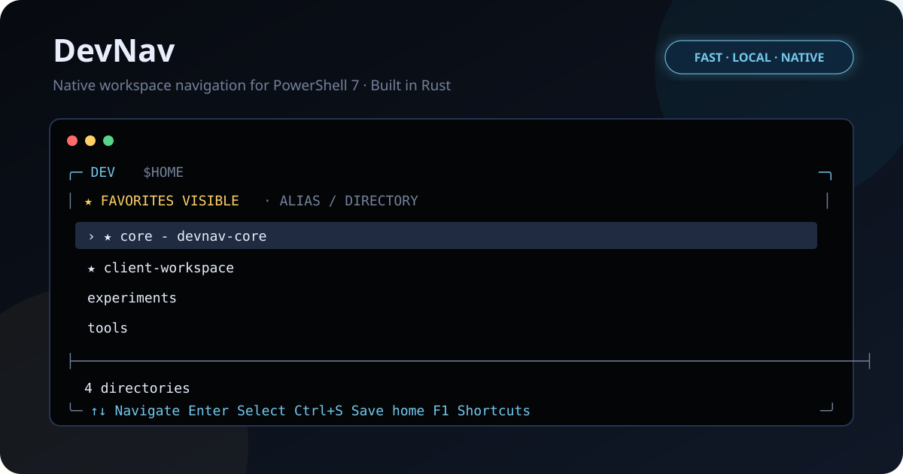

# DevNav

[English](README.md) | **Español**



**DevNav es un navegador de espacios de trabajo nativo y de alto rendimiento para
PowerShell 7 en Windows.** Permite seleccionar una carpeta, cambiar la ubicación del shell,
guardar favoritos globales, asignar alias y abrir Codex, Claude Code, OpenCode o
Kimi en el repositorio activo.

**Documentación:** [Instalación](#1-instalar-devnav) · [Primer inicio](#2-elegir-la-ruta-de-inicio) · [Shortcuts](#shortcuts) · [FAQ](#faq) · [Troubleshooting](TROUBLESHOOTING.es.md) · [Seguridad](SECURITY.md)

## Requisitos

- Windows 10 u 11, x64 o ARM64.
- PowerShell 7 o posterior (`pwsh`).
- Windows Terminal recomendado.

Los binarios publicados no requieren Rust ni Visual Studio. Windows PowerShell
5.1, Windows de 32 bits, Linux y macOS no están soportados.

## 1. Instalar DevNav

### Instalación rápida

Ejecuta una sola orden en PowerShell 7:

```powershell
irm https://raw.githubusercontent.com/JacobOptimiza/dev-nav/main/install.ps1 | iex
```

La distribución mediante WinGet se está preparando con un instalador silencioso
por usuario. Hasta que `JacobOptimiza.DevNav` sea aceptado en el origen
comunitario, utiliza el instalador de PowerShell anterior; `winget install
JacobOptimiza.DevNav` todavía no está disponible.

El instalador detecta la arquitectura, descarga el ejecutable y el módulo desde
la última release, verifica ambos checksums SHA-256 y configura el perfil.

### Instalación desde un clon

Git sólo es necesario para esta modalidad de instalación o para desarrollo.
El repositorio puede clonarse en cualquier ubicación; no tiene que estar dentro
de la carpeta que contiene tus repositorios:

```powershell
git clone https://github.com/JacobOptimiza/dev-nav.git
Set-Location dev-nav
.\install.ps1
```

### Próximos canales de gestores de paquetes

Todavía no están disponibles. Estos comandos están previstos para la primera
release multicanal, v0.10.0. Los mismos
bytes de la release también se distribuirán mediante npm y Scoop. DevNav nunca
se recompila por canal: cada paquete deriva de la release canónica de GitHub y
de su inventario `release-manifest.json`.

Con Bun, npm, pnpm o Yarn — un único paquete, `@jacoboptimiza/devnav`, actúa
como bootstrap explícito (sin `postinstall` ni dependencias en runtime):

```sh
bunx --bun @jacoboptimiza/devnav install            # Bun
npx --yes @jacoboptimiza/devnav install             # npm
pnx @jacoboptimiza/devnav install                   # pnpm
yarn dlx -p @jacoboptimiza/devnav devnav install    # Yarn
```

El bootstrap verifica el SHA-256 del instalador incluido contra el manifiesto
de la release, lo ejecuta silenciosamente y comprueba la versión instalada.
DevNav sigue siendo una aplicación independiente con su propio actualizador, así
que el paquete no necesita permanecer instalado.

Con Scoop:

```powershell
scoop bucket add jacoboptimiza https://github.com/JacobOptimiza/scoop-bucket
scoop install jacoboptimiza/devnav
```

Scoop es el propietario de los archivos que instala, por lo que una instalación
gestionada por Scoop omite su autoactualizador: actualízala con `scoop update
devnav`.

El instalador:

1. Detecta si Windows es x64 o ARM64.
2. Descarga el binario desde GitHub Releases.
3. Verifica los checksums SHA-256 del ejecutable y del módulo antes de instalarlos.
4. Copia DevNav a `%LOCALAPPDATA%\Programs\DevNav`.
5. Añade el módulo al perfil de PowerShell 7 sin modificar el `PATH` global.

Cierra y vuelve a abrir PowerShell 7. Comprueba que quedó instalado:

```powershell
Get-Command dev
```

`Get-Command dev` debe mostrar el alias de DevNav.

## 2. Elegir la ruta de inicio

La **ruta de inicio** es la carpeta que contiene tus repositorios o aquella que
quieres ver cada vez que ejecutas `dev`. La forma recomendada de configurarla no
requiere comandos ni editar archivos:

1. Ejecuta `dev`. Sólo en el primer inicio interactivo, elige si DevNav puede
   comprobar silenciosamente si hay nuevas versiones al arrancar; nunca instala
   nada sin preguntarte.
2. Una instalación nueva se abre en `$HOME`. Navega con `↑`, `↓` y `→`. Para ir
   directamente a otra ruta o unidad, pulsa `p`, escribe la ruta deseada y
   confirma con `Enter`.
3. Resalta la carpeta que quieres utilizar como inicio.
4. Pulsa `Ctrl+S` (**guardar como ruta de inicio**).
5. Revisa la ruta mostrada y pulsa `Enter` para confirmar o `Esc` para cancelar.

El siguiente `dev` arrancará directamente en esa carpeta. Puedes repetir estos
pasos en cualquier momento para cambiarla. `Ctrl+S` utiliza una combinación
deliberada y una confirmación adicional para evitar cambios accidentales.

### Alternativa para terminales, scripts o agentes

Después de instalar, Codex, Cursor o cualquier script puede configurar la misma
ruta sin abrir la TUI:

```powershell
Set-DevRoot $HOME
Get-DevRoot
```

`Set-DevRoot` valida que la carpeta exista y guarda exactamente la misma
configuración local que `Ctrl+S`.

Para compatibilidad con configuraciones anteriores, `DEV_HOME` continúa
funcionando cuando todavía no existe una ruta guardada. La ruta elegida mediante
`Ctrl+S` o `Set-DevRoot` tiene prioridad:

```powershell
$env:DEV_HOME = $HOME
```

### Actualizar

No necesitas volver a clonar el repositorio. Puedes actualizar de cualquiera de
estas dos formas:

- Desde PowerShell, ejecuta:

```powershell
dev update
```

- Desde la TUI de DevNav, pulsa `Shift+U` (`Mayús+U`). Puedes consultar este y
  el resto de shortcuts en cualquier momento pulsando `F1`.

DevNav compara la versión instalada con la última release publicada. Si ya
tienes la última, no modifica ningún archivo. Si existe una versión nueva,
descarga el ejecutable adecuado para tu arquitectura y el módulo de PowerShell,
verifica ambos con SHA-256, los instala y confirma la versión actualizada.
La actualización sólo sustituye `dev.exe` y `DevNav.psm1`: nunca elimina ni
sobrescribe `%LOCALAPPDATA%\DevNav\config.tsv`, donde se conservan la ruta de
inicio, los favoritos y los alias.

**Instalaciones gestionadas por Scoop:** utiliza `scoop update devnav` en lugar
de `dev update` o `Mayús+U`.

En el primer inicio interactivo, DevNav pregunta una sola vez si puede comprobar
en GitHub si hay nuevas versiones al arrancar. Esta comprobación nunca descarga
ni instala nada sin una confirmación explícita. No muestra nada si ya tienes la
última versión o falla la red, y se omite en sesiones no interactivas. Puedes
cambiar la preferencia guardada con `Ctrl+U` o desde PowerShell:

```powershell
Set-DevUpdateCheck $true   # activar
Set-DevUpdateCheck $false  # desactivar
```

### Compilar desde el código fuente

Solo para desarrollo; requiere Rust stable y MSVC Build Tools:

```powershell
.\install.ps1 -BuildFromSource
```

## Favoritos globales, incluso fuera de la raíz

Los favoritos no están limitados a la carpeta principal. Siempre aparecen al
principio de la lista, aunque estés navegando por otra ubicación. También se
muestra el favorito correspondiente al directorio actual, por lo que nunca
desaparece ninguno al entrar en él.

Los accesos globales se muestran por defecto. Pulsa `Shift+F` (`Mayús+F`) para
ocultarlos o volver a mostrarlos; DevNav conserva esa preferencia entre sesiones.
Ocultarlos no elimina ningún favorito ni oculta las carpetas reales del
directorio actual.

Para añadir una carpeta de otro disco o de fuera de la ruta de inicio:

1. Ejecuta `dev`.
2. Pulsa `p`.
3. Escribe una ruta absoluta, por ejemplo `D:\Clientes` o `C:\Trabajo\Repo`.
4. Pulsa `Enter` para ir a esa ubicación.
5. Navega con las flechas y `→` hasta resaltar la carpeta deseada.
6. Pulsa `f` para guardarla como favorita.

Desde ese momento aparecerá arriba en cualquier ubicación. Resáltala y vuelve a
pulsar `f` para eliminarla de favoritos. `a` permite mostrarla como
`alias - nombre-de-carpeta`.

La ruta de inicio, los favoritos y los alias son locales y se guardan fuera del repositorio en
`%LOCALAPPDATA%\DevNav\config.tsv`.

## Shortcuts

Los shortcuts están agrupados por flujo de trabajo. Las acciones más frecuentes
aparecen primero para que sean fáciles de descubrir y recordar.

### Navegación y selección

| Shortcut | Acción |
|---|---|
| `↑` / `↓` o `j` / `k` | mover la selección |
| `Enter` | seleccionar la carpeta y volver a PowerShell |
| `→` / `l` | entrar en la carpeta resaltada |
| `←` / `h` | subir al directorio padre |
| `Backspace` | subir al directorio padre |
| `.` | seleccionar el directorio mostrado |
| `g` | volver a la raíz configurada |
| `p` | ir a cualquier ruta absoluta, incluso de otro disco |
| `Ctrl+S` | guardar la carpeta resaltada como nueva ruta de inicio; requiere confirmación |
| `F1` | abrir el panel de ayuda con todos los shortcuts y su explicación |

### Agentes

| Shortcut | Acción |
|---|---|
| `c` | Codex: abrir una sesión nueva (`codex`) en la carpeta resaltada |
| `r` | Codex: reanudar la última sesión del repositorio (`codex resume --last`) |
| `d` | abrir Claude Code (`claude`) en la carpeta resaltada |
| `Shift+D` | reanudar la última sesión de Claude Code del repositorio (`claude --continue`) |
| `o` | abrir OpenCode (`opencode`) en la carpeta resaltada |
| `Shift+O` | reanudar la última sesión de OpenCode del repositorio (`opencode --continue`) |
| `i` | abrir Kimi Code (`kimi`) en la carpeta resaltada |
| `Shift+I` | reanudar la última sesión de Kimi Code del repositorio (`kimi --continue`) |

### Organización, búsqueda y acciones

| Shortcut | Acción |
|---|---|
| `/` | activar el filtro fuzzy incremental |
| `f` | añadir o quitar un favorito global |
| `Shift+F` | mostrar u ocultar los accesos globales de favoritos; el estado persiste entre sesiones |
| `a` | editar el alias de la carpeta resaltada |
| `e` | escribir y ejecutar un comando en la carpeta resaltada |
| `u` | refrescar el directorio mostrado |
| `Ctrl+U` | activar o desactivar la comprobación de actualizaciones al iniciar |
| `Shift+U` | comprobar y actualizar DevNav a la última versión publicada |
| `q` / `Esc` | cancelar y volver a PowerShell |

La barra inferior muestra sólo las acciones esenciales para no saturar la
interfaz. Pulsa `F1` en cualquier momento para consultar el panel completo;
puedes desplazarte con `↑` / `↓` y cerrarlo con `F1`, `Esc` o `Enter`.

`:` se conserva como alias compatible de `e` para quienes prefieran el estilo de
comandos de Vim.

### Comandos personalizados

Asigna comandos a `Shift+1` … `Shift+9` para ejecutarlos en el proyecto
resaltado:

```powershell
dev shortcut 1 "Dev" "bun run dev"
dev shortcut 2 "Tests" "cargo test"
```

Puedes usar `Set-DevShortcut` desde scripts, sobrescribir un slot repitiendo su
índice o eliminarlo con `Remove-DevShortcut -Index 1` (o `dev shortcut 1`). Los
atajos se guardan localmente y aparecen en la ayuda de `F1`.

También puedes elegir primero el repositorio y pasar un comando desde el shell:

```powershell
dev codex
dev "git status"
```

Los accesos de agentes son opcionales: DevNav devuelve el comando a PowerShell,
por lo que únicamente necesitas tener instalado y disponible en `PATH` el CLI que
quieras abrir.

## Arquitectura

- Rust 2024 y Win32 mediante `windows-sys`.
- Renderer VT propio con buffer de filas y repintado diferencial.
- Entrada raw mediante `ReadConsoleInputW`.
- Event loop sin polling ni renders cuando no hay eventos.
- Protocolo de resultados separado del stdout utilizado por la TUI.
- Sin frameworks TUI y con una sola dependencia directa.

## Seguridad y privacidad

- Sin telemetría. La red sólo se usa para la comprobación opcional consentida y las actualizaciones explícitas.
- Sin credenciales, secretos o configuración personal en el repositorio.
- La configuración local está separada de los archivos reemplazados al actualizar.
- Binarios de release con checksum SHA-256.
- Workflows con permisos mínimos y acciones fijadas a commits concretos.
- Dependabot revisa Cargo y GitHub Actions.
- `main` está protegida y únicamente los administradores pueden actualizarla.
- El repositorio público es de solo lectura: permite consultar, clonar y descargar,
  pero no acepta Issues ni Pull Requests externos.

Consulta [SECURITY.md](SECURITY.md) para informar vulnerabilidades de forma
privada y [CONTRIBUTING.md](CONTRIBUTING.md) para conocer la política del
repositorio.

## Desarrollo

```powershell
cargo fmt --all -- --check
cargo check --workspace --all-targets
cargo test --workspace
cargo clippy --workspace --all-targets -- -D warnings
cargo deny check
./scripts/validate-powershell.ps1
Invoke-Pester -Path ./tests/powershell
```

El repositorio fija Rust 1.97.1 con `rustfmt` y `clippy`. Los controles de
PowerShell usan el parser nativo, PSScriptAnalyzer 1.25.0 y Pester 6.1.0. Las
licencias, advisories, registros y versiones duplicadas de dependencias se
comprueban con `cargo-deny` mediante [deny.toml](deny.toml). CI ejecuta todos
estos controles.

Consulta el [roadmap público](ROADMAP.md) para conocer el trabajo de distribución
planificado.

## FAQ

Las respuestas rápidas están aquí. Los comandos de diagnóstico y los pasos
completos se encuentran en la [guía de troubleshooting](TROUBLESHOOTING.es.md).

### ¿La instalación normal necesita Rust o Visual Studio?

No. El instalador descarga y verifica el binario publicado. Rust y MSVC solo son
necesarios con `-BuildFromSource`. [Ver detalles](TROUBLESHOOTING.es.md#rust-o-cargo-no-disponibles-al-compilar).

### ¿Por qué no se reconoce `dev` después de instalar?

`dev` es un alias cargado por el módulo de PowerShell, no un ejecutable añadido
al `PATH`. Reinicia PowerShell 7 y comprueba el perfil si no aparece.
[Ver solución](TROUBLESHOOTING.es.md#el-alias-dev-no-está-disponible).

### ¿Cómo corrijo la ruta de inicio?

Resalta la carpeta correcta en la TUI y pulsa `Ctrl+S`, o ejecuta
`Set-DevRoot $HOME`. [Ver comandos](TROUBLESHOOTING.es.md#corregir-la-ruta-de-inicio).

### ¿Por qué no se abre Codex, Claude, OpenCode o Kimi?

Cada CLI es opcional y debe estar instalado y disponible en el `PATH` de
PowerShell. [Ver diagnóstico](TROUBLESHOOTING.es.md#cli-de-agente-no-encontrado).

### ¿Qué hago si PowerShell bloquea `install.ps1`?

Revisa el script y desbloquea únicamente ese archivo si confías en su origen. No
desactives globalmente las políticas de ejecución.
[Ver procedimiento](TROUBLESHOOTING.es.md#installps1-bloqueado-por-powershell).

### ¿Qué hago si falla la descarga o el checksum?

Revisa la conexión, el proxy o el firewall y vuelve a intentarlo. No omitas la
verificación SHA-256. [Ver explicación](TROUBLESHOOTING.es.md#fallo-de-descarga-o-checksum).

### ¿Qué hago si la TUI se cierra o las teclas no responden?

Usa `dev` desde PowerShell 7 en Windows Terminal, cierra instancias anteriores
y actualiza DevNav. [Ver diagnóstico](TROUBLESHOOTING.es.md#cierre-inesperado-o-entrada-de-teclado-incorrecta).

### ¿Cómo actualizo DevNav?

En instalaciones normales, ejecuta `dev update` desde PowerShell o pulsa
`Shift+U` dentro de la TUI. Si DevNav está gestionado por Scoop, utiliza
`scoop update devnav`.
[Ver pasos](TROUBLESHOOTING.es.md#actualización).

### ¿Cómo desactivo o vuelvo a activar la comprobación al iniciar?

Pulsa `Ctrl+U` dentro de la TUI. También puedes usar
`Set-DevUpdateCheck $false` o `Set-DevUpdateCheck $true` desde PowerShell. Esta
preferencia se conserva al actualizar.
[Ver detalles](TROUBLESHOOTING.es.md#cambiar-la-comprobación-al-iniciar).

## Licencia

MIT. Consulta [LICENSE](LICENSE).
